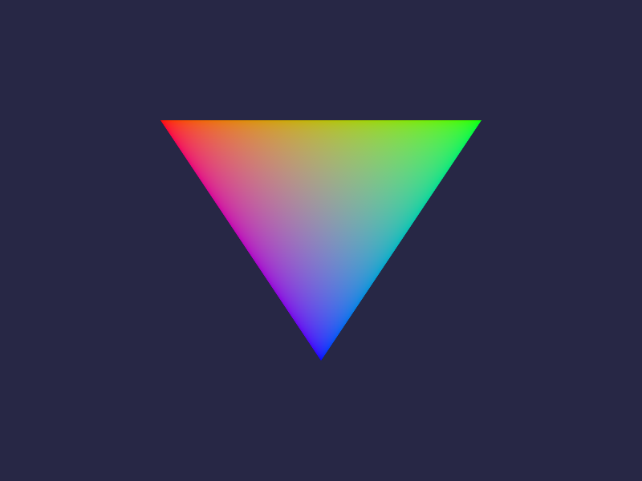

# vulkan-triangle

Minimal Vulkan 1.3 renderer that draws an index-driven gradient triangle in a
resizable window, written in C++20 against `vulkan.hpp`.

The project follows the structure of the official Khronos *Triangle* tutorial
but is an independent implementation. The two things I deliberately did
differently from the tutorial:

- **Dynamic rendering** instead of `VkRenderPass` / `VkFramebuffer`. The
  render pass is described inline in the command buffer via
  `VkRenderingInfo`, and the pipeline is told the attachment formats through
  `VkPipelineRenderingCreateInfo`. This removes the render pass, its two
  framebuffer objects, their layout transitions and the attachment bookkeeping
  — roughly a third of the code for the same output.
- **`vk::raii` wrappers** instead of manual `vkDestroy*` calls. Handles are
  members of the renderer, so cleanup order is expressed by member order
  rather than by remembering to free things in the right sequence.

## What it exercises

| Step | Vulkan objects |
|---|---|
| Window | `GLFW`, `GLFW_NO_API` |
| Debugging | `VK_EXT_debug_utils` messenger chained into `pNext` at instance creation |
| Device | queue-family lookup, required extension check, `dynamicRendering` feature |
| Presentation | swapchain, image views, format and present-mode selection |
| Pipeline | SPIR-V modules from GLSL via `glslc`, vertex input state, rasterization, colour blend |
| Data | vertex and index buffers uploaded through one persistent staging buffer |
| Sync | binary semaphore for acquire, one for render-finished, fence per frame |
| Resize | swapchain teardown and rebuild on `eErrorOutOfDateKHR` |
| Output | swapchain image read back to a `screenshot.ppm` |

`dynamicRendering` was promoted to core in Vulkan 1.3, but promoted features
are not enabled implicitly — it still has to be requested through
`VkPhysicalDeviceVulkan13Features` at device creation.

## Build

Requires CMake ≥ 3.24, a C++20 compiler, Vulkan 1.3 headers, `glslc` (from the
Vulkan SDK or `shaderc`), and GLFW 3.4 + GLM.

```sh
cmake -S . -B build -G Ninja
cmake --build build
./build/vulkan_triangle
```

On Debian/Ubuntu:

```sh
sudo apt install build-essential cmake ninja-build \
  libvulkan-dev glslc libglfw3-dev libglm-dev
```

The program renders 200 frames, prints the achieved frame rate, writes
`screenshot.ppm` and exits.

```sh
./build/vulkan_triangle --frames 0   # run until the window is closed
./build/vulkan_triangle --frames 60  # render 60 frames, then exit
```

To exercise the resize path, resize the window while it is running, or force a
rebuild by calling `recreateSwapchain()` from `drawFrame()`.

### WSL

GLFW 3.4 uses either X11 or Wayland and picks Wayland whenever `WAYLAND_DISPLAY`
is set. Under WSLg that works, but the window can end up hard to find, so the
backend can be chosen explicitly:

```sh
GLFW_PLATFORM=x11 ./build/vulkan_triangle --frames 0
```

Going through XWayland is also noticeably faster here — around 290 fps against
110 fps for the Wayland path on `llvmpipe` — because the presentation path is
shorter. The two backends also disagree on resolution: WSLg hands the Wayland
surface a scale factor of 2, so its swapchain comes out as 1600x1200 while the
window itself is 800x600. `chooseExtent()` takes `currentExtent` from the
surface capabilities whenever the compositor reports one, so the triangle is
rendered at the surface's native size rather than the window's.

## Output

`screenshot.ppm` holds the presented frame: an index-driven triangle with
per-vertex colour, red/green/blue at the corners, on a dark background. The
background reads as `(39, 39, 69)` in the file even though the clear value is
`(0.02, 0.02, 0.06)`: the swapchain format is `B8G8R8A8Srgb`, so the driver
encodes the linear clear colour into sRGB on write.

The screenshot only covers the 8-bit-per-channel formats, since a PPM cannot
hold float or 10-bit channels without a colour conversion. `chooseSurfaceFormat()`
prefers one of those and `saveScreenshot()` refuses with a diagnostic rather
than mis-decoding a wider format.



## Layout

```
src/renderer.hpp    Renderer class, Vertex struct
src/renderer.cpp    the Vulkan implementation
src/main.cpp        entry point, exception to exit code
shaders/            GLSL sources, compiled to SPIR-V at build time
```
